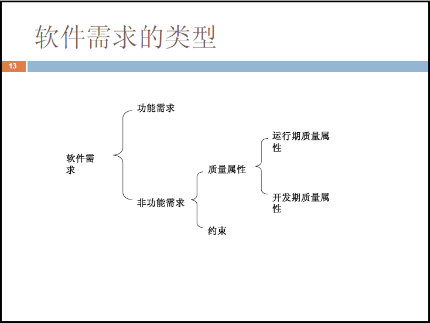

# 读后感
一本实用性很强的架构入门书籍。内容有深有浅，涉及面广，帮我们树立一个架构设计的全局观。

本书已读完，把读后感放在最前面，以下是详细的读书笔记。

1. __我们将软件架构概念分为两大流派__
  * __组成派__：软件系统的架构将系统描述为计算组件及组件之间的交互。
  * __决策派 1__：软件架构包含了关于以下问题的重要决策：
    * 软件系统的组织；
    * 选择组成系统的结构元素和它们之间的接口，以及当这些元素相互协作时所体现的行为；
    * 如何组合这些元素，使它们逐渐合成为更大的子系统；用于指导这个系统组织的架构风格：这些元素以及它们的接口、协作和组合。
  * __决策派 2__: 软件架构并不仅仅注重软件本身的结构和行为，还注重其他特性：使用、功能性、性能、弹性、重用、可理解性、经济和技术的限制及权衡，以及美学等。

2. __“架构决策是分层次依次展开的”,还表现在__
  * 决策制定的顺序往往是先制定技术无关的决策;
  * 后制定技术相关的决策，后者在前者的指导下进行;

3.  __两个流派的观点可以简单概括成__
  * 组成派: __“架构 = 组件 + 交互”__
  * 决策派: __“架构 = 重要决策集”__

4. __框架是软件，架构不是软件__
  * 框架是系统或子系统的半成品;
  * 软件架构不是软件，而是关于软件如何设计的重要决策。

5. __产品线架构一定要文档化是有道理的__

6. __软件架构师必须牢记：关注“软件运行期质量属性”，为开发人员而设计。__

7. __Philippe Kruchten在其著作《Rational统一过程引论》中写道__
>一个架构视图是对于从某一视角或某一点上看到的系统所作的简化描述，描述中涵盖了系统的某一特定方面，而省略了与此方面无关的实体。

8. __软件架构的每个视图分别关注不同的方面，针对不同的目标和用途。__

9. __从概念性架构到实际架构__
  * 先设计概念性架构，构思关键问题的解决策略；
  * 再进行实际架构的设计，以保证为开发提供足够的指导和限制......这符合人类解决问题的规律，因此被广泛采用。

10. __软件的质量属性需求__
    易用性、性能、可伸缩性、持续可用性、鲁棒性、安全性、可扩展性、可重用性、可移植性、易理解性和易测试性等,这些质量属性之间存在一定的相互矛盾的情况。

11. __制定软件架构设计策略__
    * 策略一，全面认识需求；
    * 策略二，关键需求决定架构；
    * 策略三，多视图探寻架构；
    * 策略四，尽早验证架构。

12. __高来高去式的架构设计大致有如下三种表现__
   * 症状一，缺失重要架构视图；
   * 症状二，浅尝辄止、不够深入；
   * 症状三，名不副实的分层架构;

13. __关于软件架构到底要设计到什么程度，可以归纳为两句话__
  * 由于项目的不同、开发团队情况的不同，软件架构的设计程度会有不同；
  * 软件架构应当为开发人员提供足够的指导和限制。

14. __囫囵吞枣地认为“需求就是用户的要求”绝对是不够的。__

15. __需求分析致力于搞清楚软件系统要“做什么”，而系统分析更关注“怎么做”的问题。__

16. __功能需求影响架构，而架构必须适应功能需求。但功能需求并不能决定架构，这是显而易见的。__

17. __约束性需求最为特殊，它可能产生的影响有3种__  
  （1）作为架构设计时必须遵守的限制条件；  
  （2）导致软件系统必须提供某些功能需求；  
  （3）导致软件系统必须满足某些约束性需求。

18. __用例的名称应该从参与者的角度进行描述，并以动词开头，这样一来通过“读图”可以清晰地获得用例图的语义。__
   
储蓄系统用例部分

19. __用例图最重要的元素__
  * 参与者（Actor）
  * 用例（Use Case）

20. __用例简述__  
就是通过简短的文字对用例的功能进行描述；一般而言，用例简述都应包含成功场景的简单描述。

21. __用例规约__  
是对用例的详细描述，一般包括简要说明、主事件流、备选事件流、前置条件、后置条件和优先级等。用例规约的主要目的是界定软件系统的行为需求。

22. __用例图__  
从总体上反映了用户需求，而用例简述和用例规约分别是行为需求的简化描述和详细描述。至于用例实现，已属于设计范畴了。

23. __需求变化波及不同需求工件的规律__  
  * 用例图作为功能需求的泛而不深的总体描述，它是比较稳定的；
  * 用例简述不涉及细节，因此也比较稳定；
  * 用例规约通过交互序列的方式描述功能需求，受需求变化影响较大;

24. __必须聪明地应付需求变更__
  * 推后用例细化;
  * 激发需求变更;

25. __架构师首要的第一步是做需求分析，涉及到的文档或方法依次有__
  * 需求采集卡
  * 愿景与范围文档、特性列表
  * 用例图、用例简述、用例规约
  * 原型启发需求、需求验证
  * 软件需求规格说明书（含非功能需求）

26. __领域模型对软件架构乃至整个软件系统开发工作的作用可以归纳为3点__
  * 探索复杂问题、固化领域知识；
  * 决定功能范围、影响可扩展性;
  * 提供交流基础、促进有效沟通。

27. __关键性的第一步是缩小范围。__
  * 穷兵黩武还是择战而斗？

28. __关键需求决定架构，其余需求验证架构。__

29. __软件需求的类型__

30. __软件质量属性分类方式__

31. __质量属性关系矩阵__

32. __调整后的质量属性关系矩阵__

33. __确定对软件架构关键需求的步骤__

34. __概念性架构设计大致可以分为如下三步__
  * 第一步，鲁棒性分析。
  * 第二步，引入架构模式。
  * 第三步，质量属性分析。

  

35. __各层之间的单向依赖又可以分为两种__
  严格的分层架构要求第n层只能被第n+1层调用，与此相对的是不严格的分层架构，第n层可以被位于其上层的任意一层调用。

36. __概念性架构设计时__
 * 功能需求是鲁棒性分析最主要的输入;
 * 质量属性需求是质量属性分析的最主要的输入;

 37. __“属性——场景——决策”表方法__  
   * 提倡通过一组具体场景将要达到的质量属性需求目标细化，再根据这些实实在在的场景制定架构决策。
   * 使软件架构设计的决策过程从“黑盒”变成了“灰盒”，这样做有以下好处：  
        1. 可操作性强。  
        2. 避免过度设计。  
        3. 便于系统升级时参考。

38. __一般而言，逻辑架构的设计应完成下列工作__
 * 细化功能单元；  
 * 发现通用机制；  
 * 细化领域模型；  
 * 确定子系统接口和交互机制。

39. __机制（Mechanism）是模式的实例__  
 机制必须进一步细化才能成为特定模型中的协作，因此，机制是独特上下文中重复出现的问题的特定解决方案。  

40. __进程被称为“重量级控制流”__  
 因为它既是处理机资源的分配单位，又是其他计算机资源的分配单位。

41. __线程则被称为“轻量级控制流”__  
 它仅仅是处理机资源的分配单位。一个进程内可以包含多个线程，这些线程共享所在进程的资源。

 

42. __水平原型和垂直原型__  
 根据开发原型的目的是模拟系统运行时的概貌、还是纵深地验证一个具体的技术问题，可以将原型法分为两类：水平原型和垂直原型。

43. __抛弃原型和演进原型__
有些原型用过之后是注定要被抛弃的，而有些原型我们则希望把它们保留下来作为正式开发的基础。我们又可以将原型法分为两类：抛弃原型和演进原型。

44. __验证架构有两种方法——原型法和框架法__

  * 架构原型对功能性需求的实现非常有限，那么我们“架构验证”要验证什么？答案是要__验证架构对质量属性需求的支持程度__。  
  * 架构原型所实现的有限的功能需求应经过细心挑选，这些功能要么是__用户“最关心的”__，要么是__架构师“最担心的”__。    
  * “见继承不是继承”， 在这个阶段的人，脑中的兴奋点是__“设计”__，是__职责分配、接口设计、可重用性、可扩展性、耦合度、聚合度等这些设计层的概念__。   

45. __耦合是依赖的同义词__  
被定义为“两个元素之间的一种关系，其中一个元素变化，导致另一个元素变化”。

46. __混入类的作用在__
  * 它不仅可以提高功能的重用性，减小代码冗余；
  * 而且还可以使相关的“行为”集中在一个类中，而不是分布到多个类中，避免了所谓的“代码分散”和“代码交织”问题，提高了可维护性。

 47. __不会“在实际中”造成危害的依赖关系，都是良性依赖__
  * 依赖的“理论危害”不一定成为“实际危害”，反之亦然。这就是良性依赖原则。  

48. __“面向对象设计5大原则”和良性依赖原则在应付变化方面的作用__  
 * __单一职责原则（Single-Responsibility Principle）__
>“对一个类而言，应该仅有一个引起它变化的原因”。本原则是我们非常熟悉地“高内聚性原则”的引申，但是通过将“职责”极具创意地定义为“变化的原因”，使得本原则极具可操作性，尽显大师风范。同时，本原则还揭示了内聚性和耦合性是“一物两面”的关系，为了降低耦合性，基本途径就是提高内聚性；如果一个类承担的职责过多，那么这些职责就会相互依赖，一个职责的变化可能会影响另一个职责的履行。其实OOD的实质，就是合理地进行类的职责分配。

 * __开放封闭原则（Open-Closed Principle__      
 > **“软件实体应该是可以扩展的，但是不可修改”**。本原则紧紧围绕变化展开，变化来临时，如果不必改动软件实体的源代码，就能扩充它的行为，那么这个软件实体的设计就是满足开放封闭原则的。如果我们预测到某种变化，或者某种变化发生了，我们应当创建抽象来隔离以后发生的同类变化。在Java中，这种抽象指抽象基类或接口；在C++中，这种抽象是指抽象基类或纯抽象基类。当然，没有对所有情况都贴切的模型，我们必须对软件实体应该面对的变化做出选择。

 * __Liskov替换原则（Liskov-Substitution Principle）__  
 > “子类型必须能够替换掉它们的基类型”。本原则和开放封闭原则关系密切，正是子类型的可替换性，才使得使用基类型的模块无需修改就可扩充。Liskov替换原则从基于**契约设计**演化而来，契约通过为每个方法声明“先验条件”和“后验条件”；定义子类时，必须遵守这些“先验条件”和“后验条件”。当前，基于契约的设计发展势头正劲，对实现“软件工厂”的“组装生产”梦想是一个有力的支持。

 * __依赖倒置原则（Dependency-Inversion Principle）__
>**“抽象不应依赖于细节，细节应该依赖于抽象”**。本原则几乎就是软件设计的正本清源之道。因为人解决问题的思考过程是先抽象后具体，从笼统到细节的，所以我们先生产出的势必是抽象程度比较高的实体，而后才是更加细节化的实体。于是，“细节依赖于抽象”就意味着后来的依赖于先前的，这是自然而然的重用之道。而且，抽象的实体代表着笼而统之的认识，人们总是比较容易正确认识它们，而且它们本身也是**不易变的，依赖于它们是安全的**。**依赖倒置原则适应了人类认知过程的规律，是面向对象设计的标志所在**。

 * __接口隔离原则（Interface-Segregation Principle）__
>“多个专用接口优于一个单一的通用接口”。本原则是单一职责原则用于接口设计的自然结果。一个接口应该保证，实现该接口的实例对象可以只呈现为单一的角色；这样，当某个客户程序的要求发生变化，而迫使接口发生改变时，影响到其他客户程序的可能性最小。

49. **良性依赖原则**

 * “不会在实际中造成危害的依赖关系，都是良性依赖”。通过分析不难发现，本原则的核心思想是“务实”，很好地揭示了极限编程（Extreme Programming）中“简单设计”和“重构”的理论基础。本原则可以帮助我们抵御“面向对象设计5大原则:SOLID”以及设计模式的诱惑，以免陷入过度设计（Over-engineering）的尴尬境地，带来不必要的复杂性。
 * 如果两个或更多事物中的一个发生变化，不会影响其他事物，这些事物就是正交的。正交思维最有益的用处之一，是用于分类。

48. __“模式”与“反模式”__  
根据这个模式是应该推崇的还是应该避免的，又可将它分为“模式”与“反模式”两类。经验不一定正确，反模式就是对“不要那么做”的归档。   

49. __UML推荐书籍__

  * 《UML风格》一书，汇集了很多绘制UML图的专家级建议。
  * Peter Coad大师的著作《Java Modeling In Color With UML:Enterprise Components and Process》中讲述的彩色建模方法—— 一种领域建模方面的优秀技术。

50. __里程碑（Milestone）__
根据持续反馈来进行决策的时机，叫做里程碑（Milestone）。里程碑有两种
   * 阶段结束对应的里程碑叫做主要里程碑（Major milestone）；
   * 迭代结束对应的里程碑叫做次要里程碑（Minor milestone）。

51. __软件工程概念模型__

* 将CMM定位为“过程开发与改进的需求和测试方案”。

* RUP剪裁大家讨论的比较多了，有兴趣的读者可以阅读本书参考文献中所列的《随需而变的RUP》一文。
